# Card Generator con Jest Unit Testing y Webpack

## Introducción

Buenos días.

He aquí mi prueba personal, el orden que he seguido, los comandos que he ejecutado y los problemas que me he ido encontrando, para aquel a quien para algo le pueda servir mi experiencia.

## El objetivo

El objetivo de esta práctica es replicar el ejercicio **Random Card Generator** (**Generador de cartas aleatorias**) añadiendo dos test a través de **Jest Unit Testing** y compilando (?) a través de **Webpack**.

## Configuración del proyecto

En este proyecto tengo tres archivos principales; a saber:

1. index.html
2. styles.css
3. app.js

En tanto que esta es una práctica **con fines didácticos**, todos ellos se encuentran en la raíz del documento, justo así:

```
--/
  |--index.html
  |--style.css
  |--app.js
  |--img/
```

La carpeta `img` será la encargada de contener las capturas de pantalla que se utilicen en esta documentación.

## La experiencia

### Preparando mis archivos .js

#### _Separation of concerns_

Lo primero que voy a hacer es dividir la función `valueGenerator` de mi `app.js` en dos: por un lado, `valueGenerator` —que en esta ocasión solo arrojará un valor alfanúmerico acorde a los posibles valores de las cartas (`["A", "2", "3", "4", "5", "6", "7", "8", "9", "10", "J", "Q", "K"]`)— y, por otro, `symbolGenerator`, que será el encargado de generar uno de los cuatro posibles símbolos de la baraja francesa (`["♦", "♥", "♠", "♣"]`).

De tal modo...

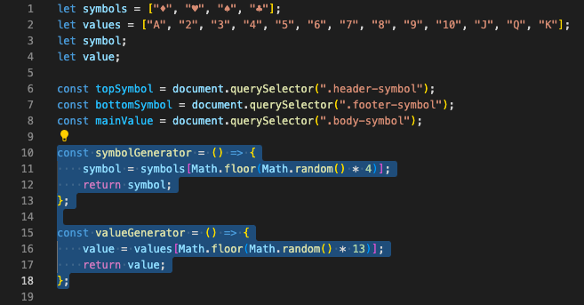

Además, como se observa en la imagen anterior, dos `return` _statements_ han sido añadido, respectivamente, a cada una de las funciones. Esto se ha hecho así para que la función _retorne_ algo que el test que más tarde desarrollaremos pueda evaluar.

Igualmente, por tanto y además, dichas funciones habrán de ser añadidas a la función `initalConfig` que era la que agrupaba las diferentes funciones que conformaban la carta una vez ejecutado el proyecto en un navegador. Es decir:

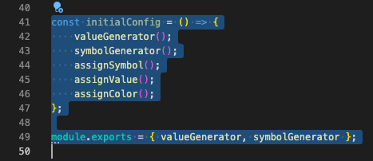

Igualmente, como puede ser observado en la imagen anterior, exporto las funciones que quiero ver evaluadas en mi test utilizando `module.exports = { valueGenerator, symbolGenerator };`.

Más información al respecto de dicha forma de exportación puede ser hallada en:

-   [FreeCodeCamp](https://www.freecodecamp.org/news/module-exports-how-to-export-in-node-js-and-javascript/)

-   [Documentación de node.js](https://nodejs.org/api/modules.html)

### Jest

#### Instalando Jest

1. Instalamos Jest haciendo uso de nuestra terminal. Para ello, ejecuto el comando `npm install --save-dev jest`.

> Recordemos, en este caso, que estamos haciendo uso de `--save-dev`, opción que nos permite guardar paquetes (?) bajo el objeto `devDependencies` en el archivo `package.json`. Cualesquiera paquetes listado bajo `devDependencies` no serán instalados en ambiente de producción. Más información en [Using npm install with the save-dev option](https://sebhastian.com/npm-save-dev)

2.  Ahora me toca inicializar mi directorio como proyecto de Node (???), lo que hago con `nmp init -y`. La bandera `-y` en este caso me ahorrará ciertas configuraciones que vendrán dadas por defecto. Como resultado, la creación del archivo `package.json` en la raíz de mi proyecto, que ahora queda así:

```
--/
  |--index.html
  |--style.css
  |--app.js
  |--package.json
  |--img/
```

3. Alteramos el contenido del `package.json` de reciente creación. Concretamente la parte que pone:

```
"scripts": {
    "test": "echo \"Error: no test specified\" && exit 1"
  },
```

Y, en su lugar, ponemos:

```
"scripts": {
    "test": "jest"
  },
```

El resultado debería ser este:

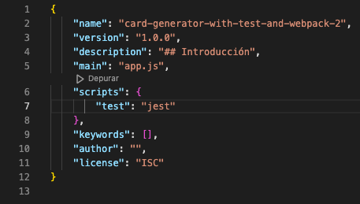

#### Escribiendo mis tests

1. Para ello, creo un archivo en la raíz de mi documento de nombre `test.js`. La estructura de mi proyecta queda como sigue:

```
--/
  |--index.html
  |--style.css
  |--app.js
  |--test.js
  |--package.json
  |--img/
```

2. En el archivo `test.js` escribo los dos tests que quiero ver ejecutados.

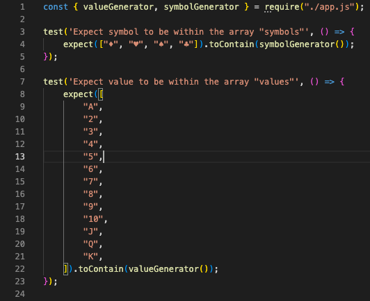

Además, como puede ser observado en la imagen superior, he tenido que importar las funciones que quiero ver evaluadas, lo que he hecho a través de `const { valueGenerator, symbolGenerator } = require("./app.js");`. Ahora bien, para entender por qué he desarrollado mis tests de la forma en la que lo he hecho cabría echarle un ojo a [**See if Value is in Array #2055 by IanMitchell (Nov 4, 2016)**](https://github.com/facebook/jest/issues/2055), cuya captura adjunto:

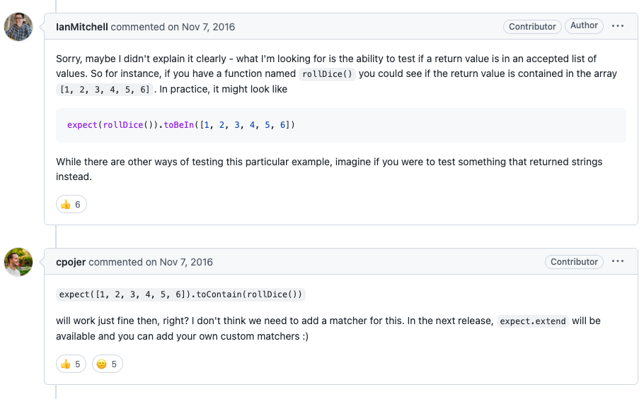

Eso me hizo pensar que podía «darle la vuelta» al _típico_ `expect()`.

#### Ejecutando mis tests

Al ejecutar mis test con `npm run test`, obtengo lo siguiente en mi terminal:

```
> card-generator-with-test-and-webpack-2@1.0.0 test
> jest

 FAIL  ./test.js
  ● Test suite failed to run

    The error below may be caused by using the wrong test environment, see https://jestjs.io/docs/configuration#testenvironment-string.
    Consider using the "jsdom" test environment.

    ReferenceError: document is not defined

      4 | let value;
      5 |
    > 6 | const topSymbol = document.querySelector(".header-symbol");
        |                   ^
      7 | const bottomSymbol = document.querySelector(".footer-symbol");
      8 | const mainValue = document.querySelector(".body-symbol");
      9 |

      at Object.document (app.js:6:19)
      at Object.require (test.js:1:45)

Test Suites: 1 failed, 1 total
Tests:       0 total
Snapshots:   0 total
Time:        1.288 s
Ran all test suites.
```

Como vemos, la suite ha fallado y, de entre todo ese _output_ arrojado por la terminal, destaca el mensaje:

> ```
> The error below may be caused by using the wrong test environment, see https://jestjs.io/docs/configuration#testenvironment-string.
> Consider using the "jsdom" test environment.
> ```

Acceder al enlace sugerido no me ha servido, personalmente, de mucho. En cambio, investigado el mismo mensaje en Google, llegué, como primer resultado de mi búsqueda, a esta consulta en [StackOverflow](https://stackoverflow.com/questions/69227566/consider-using-the-jsdom-test-environment) que muestro en la captura a continuación:

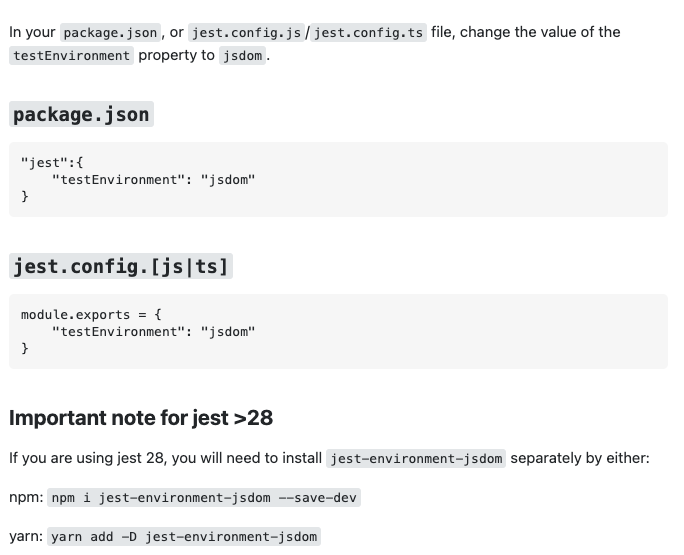

Así, recibida esa información, procedo a cambiar el contenido de mi `package.json`, de tal modo que quede así:

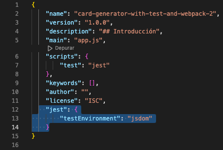

Ahora bien, de acuerdo a esa misma información:

> **Important note for jest \>28**
>
> If you are using jest 28, you will need to install jest-environment-jsdom separately by either:
>
> `npm i jest-environment-jsdom --save-dev`

La versión de jest se puede chequear ejecutando en el terminal el comando `npm view jest version`. En mi caso, mi terminal me indica que estoy usando la versión 29.3.1, por lo que ejecutaré el comando `npm i jest-environment-jsdom --save-dev` para ver solucionado el error que la terminal me arrojó al ejecutar mi test por primera vez.

Una vez ejecutado, puede comprobar en mi `package.json` que nuevas líneas han sido añadidas. Las muestro en esta captura a continuación.

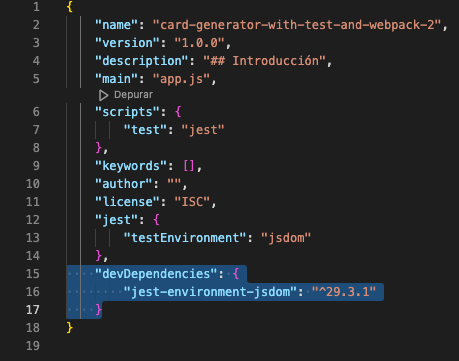

Igualmente, ha cambiado la estructura de mi proyecto, que ahora luce tal que así:

```
--/
  |--index.html
  |--style.css
  |--app.js
  |--test.js
  |--package.json
  |--img/
  |--node_modules/
  |--package-lock.json
```

Pudiendo ver que se ha generado una nueva carpeta (`node_modules`) así como un nuevo archivo JSON (`package-lock.json`).

A partir de ahí, si ejecuto mis test con `npm run test`, por fin...

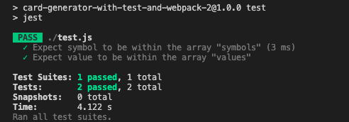

Mis tests no solo han sido ejecutados sino que, además, cumplen las condiciones propuestas en ellos, de modo tal que, además de ejecutados, están aprobados.

### Webpack

#### Instalando Webpack

Tal y como hemos hecho con Jest, procedemos a instalar Webpack

`npm install webpack --save-dev`

Lo primero que podamos observar una vez lo hayamos hecho es que nuestro `package.json` se ha visto modificado una vez más, en este caso con una nueva dependencia (?) tal y como muestra la captura a continuación:

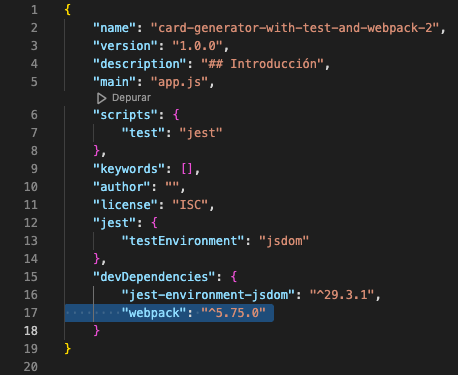

#### Configurando Webpack

Lo siguiente que vamos a hacer es configurar el archivo `package.json` añadiéndole un nuevo script:

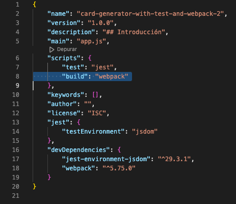

Ahora bien, de acuerdo a [Academind](https://www.youtube.com/watch?v=GU-2T7k9NfI), hay que fijar un punto de entrada (_entry point_) en esa misma línea, así como un punto de salida (_exit point_), de modo tal que el resulado final habría de ser algo así como...

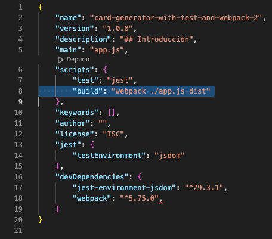

#### Ejecutando Webpack

Así, sin más dilación, ejecuto `npm run build` en mi terminal. Y recibo el siguiente mensaje:

```
> card-generator-with-test-and-webpack-2@1.0.0 build
> webpack ./app.js ./dist/

CLI for webpack must be installed.
  webpack-cli (https://github.com/webpack/webpack-cli)

We will use "npm" to install the CLI via "npm install -D webpack-cli".
Do you want to install 'webpack-cli' (yes/no):
```

Dicen las dos últimas líneas:

> Usaremos "npm" para instalar el CLI (_Command Line Interface_) vía "npm install -D webpack-cli".
>
> Quieres instalar 'webpack-cli' (sí/no):

Le decimos que sí (_yes_) y este es el _output_ del terminal a continuación:

```
Installing 'webpack-cli' (running 'npm install -D webpack-cli')...

added 40 packages, and audited 221 packages in 5s

22 packages are looking for funding
  run `npm fund` for details

found 0 vulnerabilities
assets by status 496 bytes [cached] 1 asset
./app.js 1.23 KiB [built] [code generated]

WARNING in configuration
The 'mode' option has not been set, webpack will fallback to 'production' for this value.
Set 'mode' option to 'development' or 'production' to enable defaults for each environment.
You can also set it to 'none' to disable any default behavior. Learn more: https://webpack.js.org/configuration/mode/

ERROR in main
Module not found: Error: Can't resolve './dist/' in '/Users/AGLAYA/Local Sites/card-generator-with-test-and-webpack-2'
resolve './dist/' in '/Users/AGLAYA/Local Sites/card-generator-with-test-and-webpack-2'
  Parsed request is a directory
  using description file: /Users/AGLAYA/Local Sites/card-generator-with-test-and-webpack-2/package.json (relative path: .)
    Field 'browser' doesn't contain a valid alias configuration
    using description file: /Users/AGLAYA/Local Sites/card-generator-with-test-and-webpack-2/package.json (relative path: ./dist)
      as directory
        /Users/AGLAYA/Local Sites/card-generator-with-test-and-webpack-2/dist doesn't exist

webpack 5.75.0 compiled with 1 error and 1 warning in 616 ms
```

**Por partes**:

1. Lo primero que podemos ver en nuestro `package.json` es que se ha generado una nueva dependencia (?):

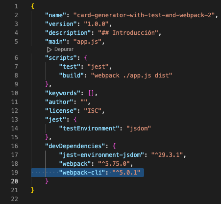

2. Por otro lado, de acuerdo al enlace que aparece en ese _output_, una de las formas de configurar el _'mode'_ es llamándolo a través de la propia línea de comandos mediante el comando `webpack --mode=development`. Ahora bien, más que llamarlo a través de la propia línea de comandos, vamos a insertar la bandera `--mode=development` en el `package.json`:

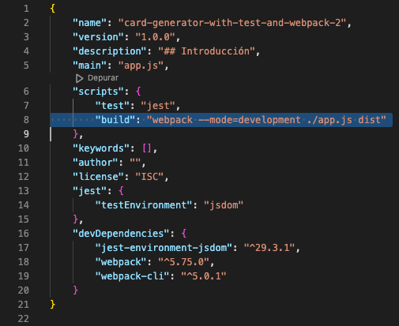

Ahora sí, ejecutamos `npm run build`, lo que nos permite observar dos cuestiones:

1. La estructura de mi proyecto ha cambiado incluyendo una carpeta `dist` con el contenido `main.js`. Por tanto, la estructura de nuestro proyecto quedaría tal que:

```
--/
  |--index.html
  |--style.css
  |--app.js
  |--test.js
  |--package.json
  |--img/
  |--node_modules/
  |--package-lock.json
  |--dist/
         |--main.js
```

2. Este es el _output_ del terminal:

```
> card-generator-with-test-and-webpack-2@1.0.0 build
> webpack --mode=development ./app.js dist

asset main.js 3.5 KiB [emitted] (name: main)
./app.js 1.31 KiB [built] [code generated]

ERROR in main
Module not found: Error: Can't resolve 'dist' in '/Users/AGLAYA/Local Sites/card-generator-with-test-and-webpack-2'
resolve 'dist' in '/Users/AGLAYA/Local Sites/card-generator-with-test-and-webpack-2'
  Parsed request is a module
  using description file: /Users/AGLAYA/Local Sites/card-generator-with-test-and-webpack-2/package.json (relative path: .)
    Field 'browser' doesn't contain a valid alias configuration
    resolve as module
      looking for modules in /Users/AGLAYA/Local Sites/card-generator-with-test-and-webpack-2/node_modules
        single file module
          using description file: /Users/AGLAYA/Local Sites/card-generator-with-test-and-webpack-2/package.json (relative path: ./node_modules/dist)
            no extension
              Field 'browser' doesn't contain a valid alias configuration
              /Users/AGLAYA/Local Sites/card-generator-with-test-and-webpack-2/node_modules/dist doesn't exist
            .js
              Field 'browser' doesn't contain a valid alias configuration
              /Users/AGLAYA/Local Sites/card-generator-with-test-and-webpack-2/node_modules/dist.js doesn't exist
            .json
              Field 'browser' doesn't contain a valid alias configuration
              /Users/AGLAYA/Local Sites/card-generator-with-test-and-webpack-2/node_modules/dist.json doesn't exist
            .wasm
              Field 'browser' doesn't contain a valid alias configuration
              /Users/AGLAYA/Local Sites/card-generator-with-test-and-webpack-2/node_modules/dist.wasm doesn't exist
        /Users/AGLAYA/Local Sites/card-generator-with-test-and-webpack-2/node_modules/dist doesn't exist
      /Users/AGLAYA/Local Sites/node_modules doesn't exist or is not a directory
      looking for modules in /Users/AGLAYA/node_modules
        single file module
          using description file: /Users/AGLAYA/package.json (relative path: ./node_modules/dist)
            no extension
              Field 'browser' doesn't contain a valid alias configuration
              /Users/AGLAYA/node_modules/dist doesn't exist
            .js
              Field 'browser' doesn't contain a valid alias configuration
              /Users/AGLAYA/node_modules/dist.js doesn't exist
            .json
              Field 'browser' doesn't contain a valid alias configuration
              /Users/AGLAYA/node_modules/dist.json doesn't exist
            .wasm
              Field 'browser' doesn't contain a valid alias configuration
              /Users/AGLAYA/node_modules/dist.wasm doesn't exist
        /Users/AGLAYA/node_modules/dist doesn't exist
      /Users/node_modules doesn't exist or is not a directory
      /node_modules doesn't exist or is not a directory

webpack 5.75.0 compiled with 1 error in 180 ms
```

### Pasos finales

Ahora entiendo que lo siguiente sería cambiar el llamamiento al script que se hace en `index.html`. Si originalmente apúntabamos al `app.js` de nuestra raíz, ahora debería apuntar al `main.js` que está dentro de la carpeta `dist`. Por tanto...

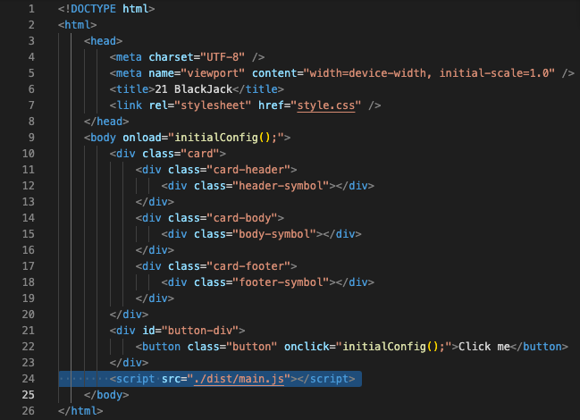

Pero, lamentablemente, a la hora de ejecutar el proyecto en un navegador... **el proyecto no funciona**.

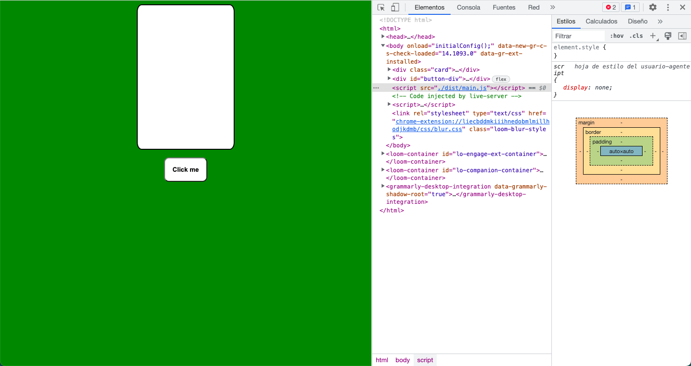

## Conclusiones

1. Por obvio, el _output_ del terminal la última vez que ejecutamos `npm run build` está cargado de errores que, entiendo, son los que evitan que el proyecto finalmente funcione.
